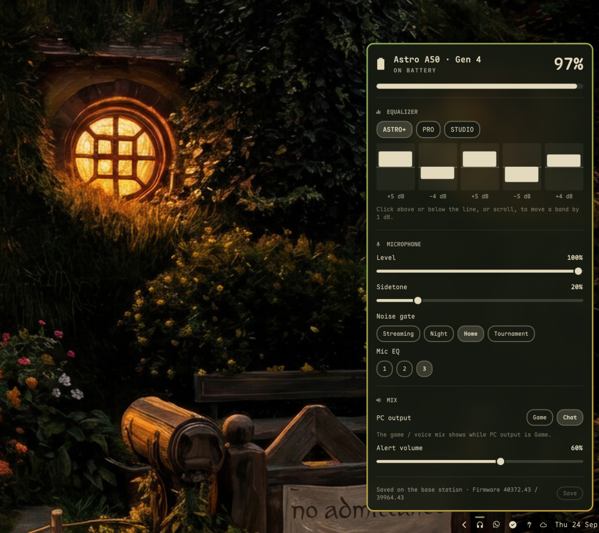

# leonavas.astroa50



An Omarchy bar widget for the **Astro A50 headset, Gen 4 and Gen 5**. It shows
the battery and the settings that otherwise need Astro Command Center or G HUB
on Windows.

## Battery alerts

- **15%**: the icon turns yellow and you get a desktop notification.
- **5%**: the icon turns red and you get a critical notification that stays on screen.
- **Time left**: while the headset is on and off the dock, the panel shows how long
  the battery has left (`3h 25m`, or `45m` under an hour), fitted to how fast it
  has been dropping. It says "estimating…" until it has seen two percent steps
  over 20 minutes; time with the headset off doesn't count.

## Features

| Feature | Gen 4 | Gen 5 |
|---|:-:|:-:|
| Battery level, charging state and time left | ✓ | ✓ |
| Equalizer presets | ✓ 3 on the station | ✓ Flat, Gaming, Media |
| Equalizer bands | ✓ 5 bands, ±7 dB | ✓ 10 bands, ±6 dB |
| Mic level | ✓ | |
| Sidetone | ✓ | ✓ |
| Noise gate (Off/Streaming, Night, Home, Tournament) | ✓ | ✓ |
| Mic EQ preset | ✓ | |
| Game/voice mix | ✓ slider | ✓ reads the headset dial |
| Headset volume | | ✓ |
| Alert volume | ✓ | |
| Dock light | | ✓ |
| PC output switch (game or chat channel) | ✓ | ✓ |
| Save to base station, Undo, back to original | ✓ | |

Gen 5 applies changes right away. On Gen 4, press **Save** to keep them after
power off.

## Interactions

| Gesture | Action |
|---|---|
| Left or right click | Open the panel |
| Middle click | Show or hide the percentage |
| Wheel on the icon, `←` `→` in the panel | Cycle EQ presets |
| Click or scroll on an EQ band | Move it by 1 dB |

## Requirements

- Python 3 (standard library only)
- A udev rule so your user can open the base station:

```bash
sudo install -m644 udev/70-astro-a50.rules /etc/udev/rules.d/
sudo udevadm control --reload
sudo udevadm trigger --action=change --subsystem-match=hidraw
```

## Install

```bash
omarchy plugin add https://github.com/leonavas/omarchy-astroa50.git
omarchy plugin enable leonavas.astroa50 --section right
```

Then install the udev rule above from `~/.config/omarchy/plugins/leonavas.astroa50/`.

## Remove

```bash
omarchy plugin disable leonavas.astroa50
omarchy plugin remove leonavas.astroa50
sudo rm /etc/udev/rules.d/70-astro-a50.rules
```

## CLI, backup and restore

```bash
bin/astro-a50 status                 # everything, as JSON
bin/astro-a50 set sidetone 20
bin/astro-a50 status > backup.json   # backup
bin/astro-a50 restore backup.json    # restore
```

## What it writes

- **The base station**, only when you change a setting.
- Its own entry in `~/.config/omarchy/shell.json`, only when you toggle the percentage.
- `~/.local/state/astro-a50/battery.json`, the current discharge (one point per
  percent step) behind the time-left estimate. Docking starts it over.
- Gen 5 only: `~/.local/state/astro-a50/gen5.json`, which remembers the last
  sidetone, EQ, noise gate and dock light values because the station can't
  report them back.

It needs no network access and no sudo, except for installing the udev rule.

## Credits

This is an independent Python implementation of protocols reverse engineered by others:

- Gen 4: [eh-fifty](https://github.com/tdryer/eh-fifty) by Tom Dryer
- Gen 5: [HeadsetControl](https://github.com/Sapd/HeadsetControl) and
  [HeadsetControl-A50-GUI](https://github.com/lluiseduardo-silva/HeadsetControlA50Gui)

Tested on a Gen 4. Gen 5 support follows the documented protocol and has not
been tested on hardware yet. The protocols are unofficial, so use at your own risk.

## License

MIT. See [LICENSE](LICENSE).
